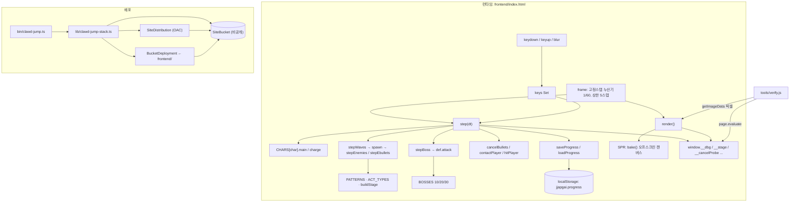
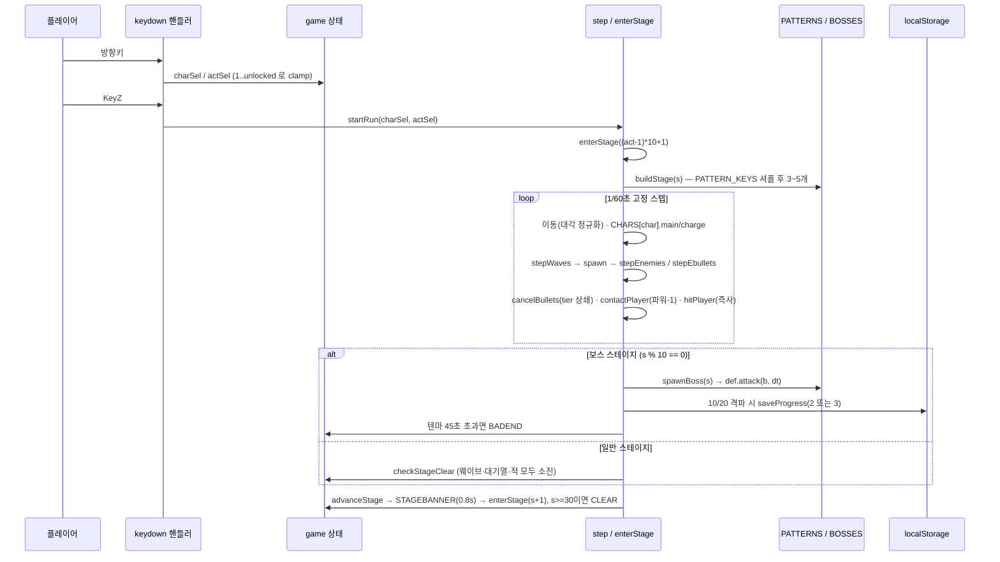

# 짭가이(clawd-jump) 아키텍처

## 1. 개요
- 한 줄 요약: 단일 HTML 파일로 된 Canvas 횡스크롤 슈팅 게임과, 그 정적 파일을 S3+CloudFront에 올리는 CDK 스택.
- 스택: vanilla JS(외부 라이브러리 0) + Canvas 2D / TypeScript + AWS CDK v2(Node) / 검증은 Node + playwright-core.
- 진입점: 게임 `frontend/index.html`의 IIFE → `requestAnimationFrame(frame)`, 인프라 `bin/clawd-jump.ts`, 검증 `npm test`(= `tools/verify-all.js`).

## 2. 구성 요소
| 경로 | 역할 | 의존 대상 |
|---|---|---|
| `frontend/index.html` | 게임 전체(상수·스프라이트·상태·입력·발사·step·render·루프 10절) | 브라우저 Canvas 2D, `localStorage` |
| `tools/verify.js` | 헤드리스 검증 하니스, 시나리오 15개 · 단정 75개 | playwright-core(chromium), `window.__*` 훅 |
| `tools/verify-all.js` | 전체 실행 러너(`npm test`). 서버 기동·정리, 단정 집계, 프리플라이트 | `tools/verify.js`, python3(정적 서버) |
| `bin/clawd-jump.ts` | CDK 앱 진입점 | `ClawdJumpStack`, `CDK_DEFAULT_*` |
| `lib/clawd-jump-stack.ts` | 비공개 S3 + CloudFront(OAC) + BucketDeployment | `aws-cdk-lib`, `frontend/` 디렉터리 asset |
| `cdk.json` | 합성 명령 `npx tsc && npx tsx bin/clawd-jump.ts` | tsx, typescript |
| `docs/superpowers/` | 스펙·구현 계획(폐기된 플랫포머 문서 포함) | — |

## 3. 구조 도면

## 4. 핵심 흐름

## 5. 데이터와 외부 의존
- 영속 상태: `localStorage["jjapgai.progress"] = {act}` 하나. 예외 시 모듈 스코프 `memoryAct` 폴백이고 사용자에게 알리지 않는다. DB·큐·캐시·외부 API·인증 공급자 없음.
- 상태 기계: `TITLE` / `PLAYING` / `STAGEBANNER` / `CLEAR` / `BADEND` / `GAMEOVER`.
- 난이도는 `game.stage` 하나에서 `hpMul`·`fireMul`·`spdMul` 세 배율로만 파생. 적탄 `tier`는 스케일하지 않는다.
- AWS 리소스: S3(`BLOCK_ALL`, S3 관리 암호화, `enforceSSL`, `DESTROY`+`autoDeleteObjects`), CloudFront(OAC, `REDIRECT_TO_HTTPS`, `CACHING_OPTIMIZED`, `PRICE_CLASS_100`, `defaultRootObject: index.html`), BucketDeployment(`max-age=300`, 무효화 `/*`), 출력 `SiteUrl`.
- 환경변수 키: `CDK_DEFAULT_ACCOUNT`, `CDK_DEFAULT_REGION`, `CJ_URL`, `CJ_PW`, `CJ_PORT`, `CJ_TIMEOUT`, `CJ_ONLY`. 시크릿 없음.

## 6. 검증 진입점

`npm test` → `tools/verify-all.js` → 시나리오마다 `node tools/verify.js <이름>` 을 자식
프로세스로 순차 실행. 실측 `시나리오 15/15, 단정 75개, 98.6s`.

- 목록은 `verify.js --list` 가 단일 출처다. 러너에 복제하지 않는다 — 복제하면 새 시나리오가 전체 실행에서 조용히 빠진다.
- 순차 실행이다. 병렬은 CPU 경합으로 rAF 프레임을 떨어뜨려 타이밍 단정(`loop` 의 `stepsAdvanced` 28~32)을 간헐 실패시킨다.
- 단정 총계는 자식의 출력 JSON에서 집계한다. 종료 코드가 판정 권위이고 파싱은 정보 제공용이다.
- 시나리오 0개를 돌리고 성공으로 끝나지 않도록 명시 가드(exit 2)가 있다.
- 프리플라이트가 `playwright-core` 누락과 chromium 바이너리 누락을 한 번에 구분해 잡는다.
- 러너가 띄운 정적 서버만 종료한다(`finally` + SIGINT/SIGTERM). 이미 떠 있는 서버는 재사용하고 죽이지 않는다.

이전 상태: 러너가 없어 수동 15회 실행만이 게이트였고, `npm test` 는 본문이 전부 주석인
CDK 스캐폴드 테스트 하나로 `1 passed` 를 냈다. 그 파일과 `jest.config.js`, jest 계열
devDependencies 4개를 제거했다(`tsconfig.json` 의 `types: ["jest"]` 도 함께 — 남기면 빌드가 깨진다).

## 7. 확인 필요
- CI 워크플로 파일이 없다(`.github/` 없음). 게이트는 로컬 `npm test` 로만 걸리며, PR에서 자동으로 강제되지 않는다.
- `frontend/` 전체가 배포 asset이므로, 향후 파일이 추가되면 캐시 정책(`max-age=300`)이 함께 적용되는 점은 코드로만 확인했고 운영 의도는 미확인.
- CloudFront에 `responseHeadersPolicy`(보안 헤더)와 `errorResponses`가 없다. 리뷰에서 나왔고 의도적으로 뒤로 미룬 항목이다.
